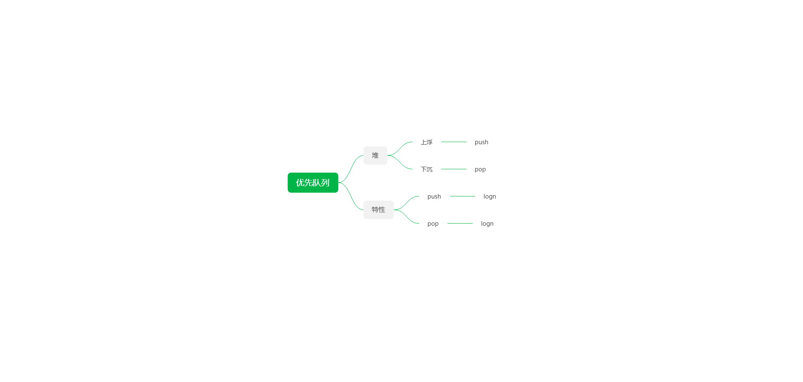
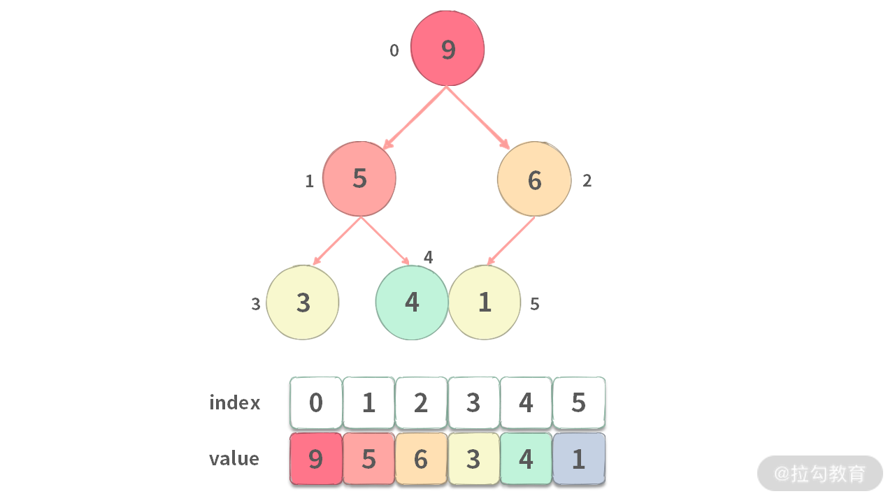

优先队列
====

优先队列的介绍
-------

### 优先队列的实现

### 优先队列的操作

堆
-

### 堆的表示

### 堆的分类

### 堆在优先队列中的应用

### 堆的操作

pop操作
-----

Push操作
------

优先队列，节点之间需要先进行排序，然后再确定优先级。例如：不论节点插入的顺序，每次出列的时候，都必须要是最小值。通常，优先队列依赖堆来实现。

堆
-

堆的表示：

大部分情况下使用数组表示堆，而不是使用二叉树，因为：

* 数组的内存具有连续性，访问速度更快。
* 堆的结构是一颗完全二叉树

下图展示了堆的数组形式的表示，

堆的数组表示有以下规律：

* 针对于节点i，父节点的下标为(i-1)/2
* 针对于节点i，左子节点的下标为 2\*i + 1
* 针对于节点i，右子节点的下表为 2\*i + 2

例如：上图中值为 5 的节点，下标为 1，那么它的父节点是 下标为 (1 - 1)/2 = 0 的节点，左子节点是 下标为 1 \* 2 + 1 = 3 的节点，右子节点是 下标为 2 \* 1 + 2 = 4 的节点。

### 分类

* 大堆，堆顶永远是最大值
* 小堆，堆顶永远是最小值

以下，默认以大堆为例。

### 堆的pop操作

pop操作：弹出堆顶最大值。