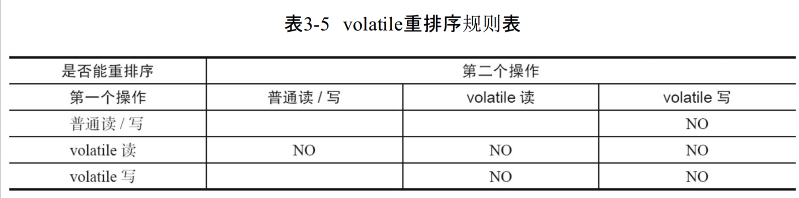

基于 happen-before 原则

举例：FeatureTask set get 方法 中间引入一个completing 状态 ，使用 cas 对一个参数进行 设置 保证另一个参数的线程安全

假设 有两个变量 volatile int a;int b; 其中 a 变量由 volatile 修饰保证其在被修改后可以马上被其他线程可见。 现有需求：a 初始值为 0 当 a 设置为 2 的同时，初始值为0的 b 变量也要被设置为 2；

### 直接写代码

get 方法

if (a=2){

 return b;

}

set 方法

if (cas(a,0,2)){

 b = 2;

}

 分析 get 方法在判断 a 为 2 时直接返回b。在 set 方法中，cas 操作可以保证a原子的被从0修改到2。

但是，a 修改到2操作与b的复制为2的操作并不是原子的，且2没有被volatile修饰，并不能立马被其他线程读取。

### 另外的set代码

if(a == 0){

b = 2;

a = 2;

}

第一个操作是 普通写，第二操作是 volatile 写，不会进行重排序。

为什么不行？

对a的判断与设值没有加锁，多个线程会重复进入代码块，逻辑应该是没问题，但是不是符合线程安全的要求。

### 可行的set代码

if(cas(a,0,1)){

b = 2;

a = 2;

}

以上代码，引入a的中间状态1。到达了一个效果，

a 设置为 1 先于 b 设置为 2 先于 a 设置为2

而 读取b 首先要让 a 为 2。所以，b 借助一个 volatile 修饰的a，达到了一个 读取 b 为 2 前，b 必然已经设置为 2 的效果。

另外，由于内存屏障：

* 在每个volatile写操作的前面插入一个StoreStore屏障
* 在每个volatile写操作的后面插入一个StoreLoad屏障
* 在每个volatile读操作的前面插入一个LoadLoad屏障
* 在每个volatile读操作的后面插入一个LoadStore屏障

在 set a = 2 前会插入一个 storestore 屏障，保证 b = 2 先于 a = 2 被其他 cpu 可见